# EMBER

**Encrypted Mesh Based Emergency Response — Community Resilience OS**

[](https://www.gnu.org/licenses/agpl-3.0)
[](https://reactnative.dev)
[](https://expo.dev)
[](https://www.typescriptlang.org)

---

<div align="center">
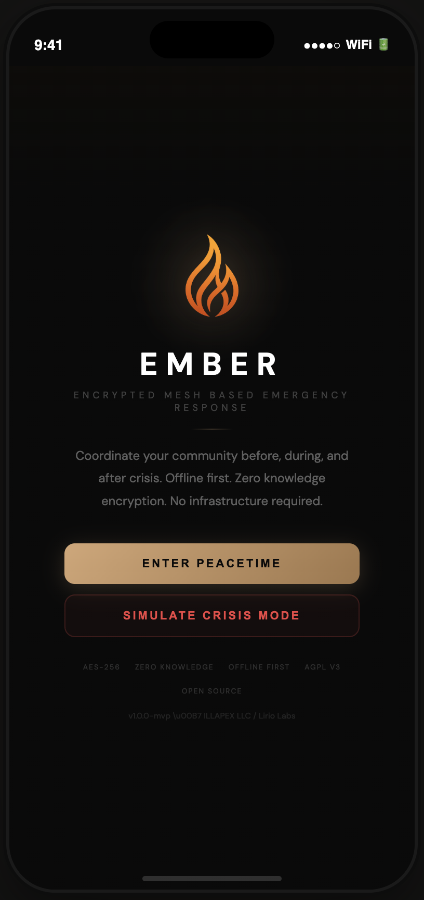
<br />
<em>Offline-first. Zero-knowledge encrypted. No infrastructure required.</em>
</div>

---

## Screenshots

### Peacetime Mode

Peacetime mode is where communities prepare. Track supplies, run drills, manage members, store emergency plans, and build readiness — all encrypted and offline-first.

<p align="center">
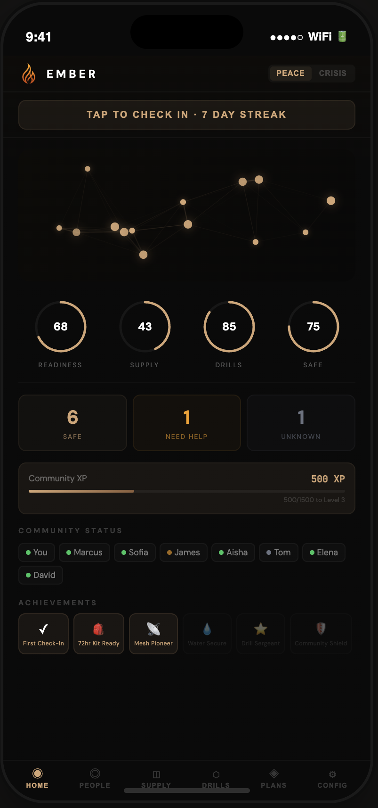
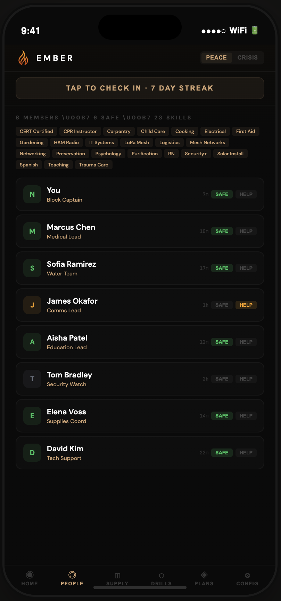
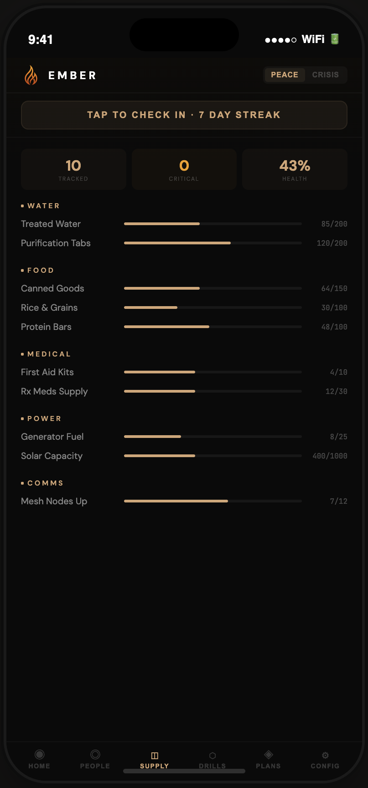
</p>
<p align="center">
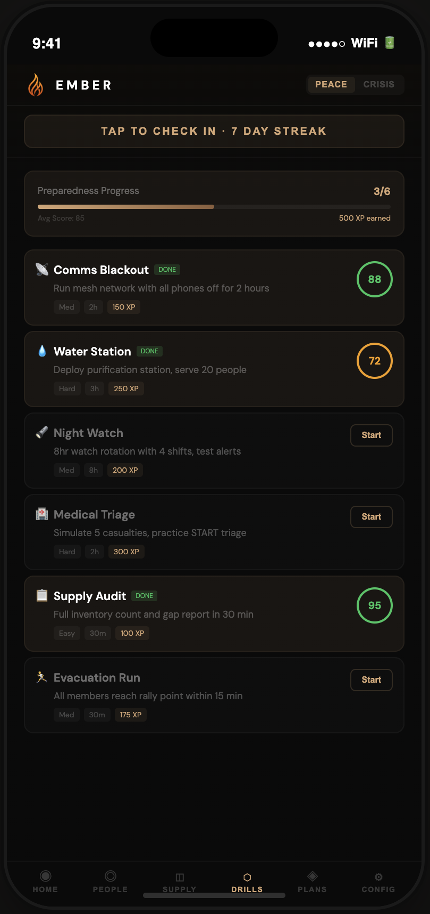
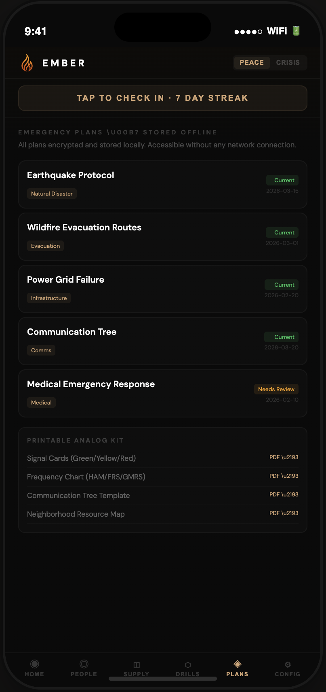
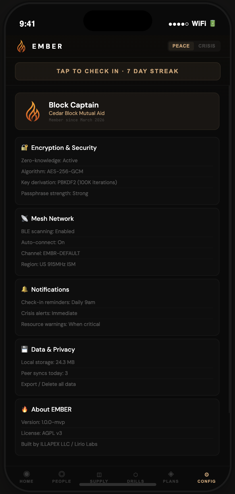
</p>

<p align="center">
<sub><strong>Left to right:</strong> Dashboard with readiness scores & community map · Member directory with roles & skills · Categorized supply inventory · Preparedness drills with XP system · Encrypted emergency plans & printable analog kit · Encryption, mesh & privacy settings</sub>
</p>

### Crisis Mode

When disaster strikes, EMBER shifts to a red-alert interface optimized for urgency. Long-range sync uses a **Meshtastic radio over BLE** (pairing, diagnostics, and encrypted snapshot broadcast on **Status** and **Config → Mesh Network**); the **People** tab stays the member roster so mesh tooling is not conflated with the directory.

<p align="center">
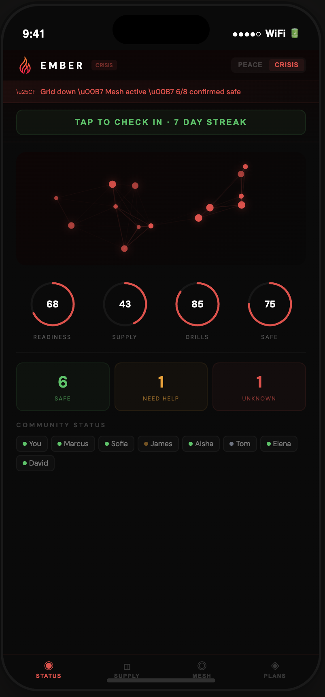
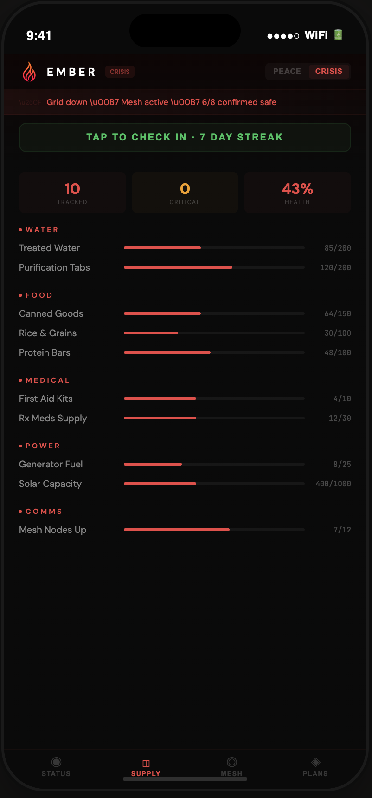
</p>
<p align="center">
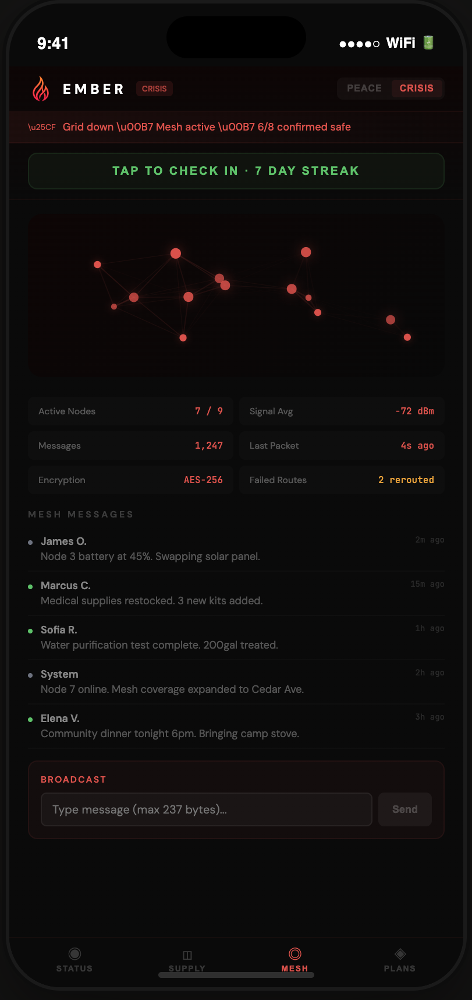
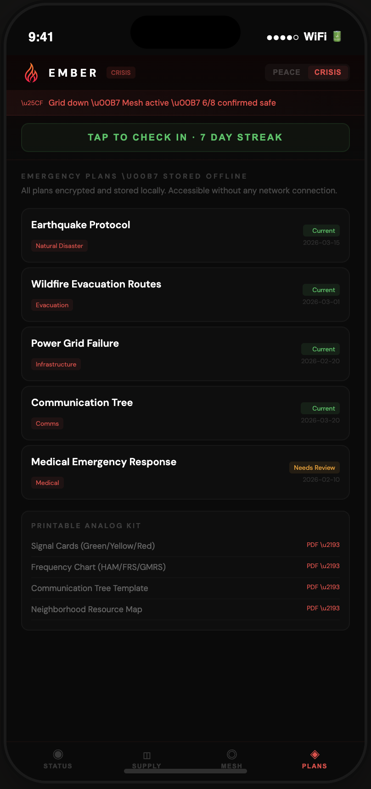
</p>

<p align="center">
<sub><strong>Left to right:</strong> Crisis dashboard (Status) with mesh summary + broadcast when connected · Supply · People roster (same label as peacetime; not the Mesh settings screen) · Emergency plans offline</sub>
</p>

---

## Quick Demo

**No install required.** Clone and open the interactive prototype in your browser:

```bash
git clone https://github.com/ember-resilience/ember.git
cd ember/demo
open index.html    # macOS
# or: xdg-open index.html (Linux) / start index.html (Windows)
```

This renders the full EMBER UI prototype with peacetime mode, crisis simulation, community management, resource tracking, drill system, emergency plans, and mesh network visualization. All interactive, all in-browser.

---

When disasters strike, the communication infrastructure people depend on fails first. Cell towers go down. Internet disappears. Cloud platforms become unreachable. The communities that need coordination most urgently are left completely disconnected. Existing emergency tools (FEMA apps, Citizen, Nextdoor) all require functioning internet and route data through centralized servers, making them useless precisely when needed most.

EMBER solves this with a zero-knowledge, offline-first architecture. All community data is encrypted on device before it ever touches any network. In peacetime, neighbors coordinate resources, complete preparedness drills, and store emergency plans locally. When crisis hits, EMBER switches to mesh communication via LoRa radio (Meshtastic protocol), enabling encrypted messaging and coordination across 1-5km with zero internet dependency.

## Architecture

EMBER is a three-tier system. Each tier is independent:

**Tier 1: EMBER App** (this repository) — Free, open source (AGPL v3). React Native mobile app with offline-first database, zero-knowledge encryption, community coordination, resource tracking, preparedness gamification, and check-in system. Works on any phone. No special hardware required. This is the entry point and the largest user base.

**Tier 2: EMBER Node Kits** — Pre-configured Meshtastic relay nodes with solar panels and weatherproof enclosures. Extend mesh communication range. Run indefinitely without grid power. Paired with the app via BLE.

**Tier 3: EMBER Communicator** — Standalone device (T-Deck Plus based) with keyboard, screen, and LoRa radio. Zero phone dependency. Pre-loaded with community emergency plans, frequency charts, and offline maps. Solar chargeable.

## Features

- **Offline-first database** — WatermelonDB on SQLite. All data available without connectivity
- **Zero-knowledge encryption** — NaCl secretbox (XSalsa20-Poly1305). Keys derived from community passphrase via PBKDF2
- **Community coordination** — Create/join communities, manage members, assign roles
- **Resource tracking** — Categorized inventory (Water, Food, Medical, Power, Comms) with critical thresholds
- **Preparedness gamification** — Drills with XP, achievements, readiness scores, daily check-in streaks
- **Emergency plans** — Encrypted offline storage with printable analog kit
- **Crisis mode** — Simplified UI, mesh-first communication, power-optimized operation
- **Mesh network (prototype)** — BLE + Meshtastic protobufs (`want_config`, FromRadio, FromNum); **`MeshRadioProvider`**; portnum **270** envelope v1/v2 + Phase B decrypt/merge; **Config → Mesh Network** for pairing and **Broadcast encrypted snapshot**; **Status** (crisis) / **Home** (peacetime) for summary + crisis broadcast; **People** tab is roster-only (crisis copy points users to mesh controls). [docs/MESHTASTIC-BLE.md](docs/MESHTASTIC-BLE.md) · [docs/MESH-FIELD-TEST.md](docs/MESH-FIELD-TEST.md) · [docs/PLAN-MESH-TIER2-ROLLOUT.md](docs/PLAN-MESH-TIER2-ROLLOUT.md).
- **CRDT sync** — Conflict-free replicated data types for offline conflict resolution

## Tech Stack

| Layer | Technology |
|-------|-----------|
| Framework | Expo SDK 52 + Expo Router |
| Language | TypeScript (strict) |
| Database | WatermelonDB (SQLite native, LokiJS web) |
| Encryption | tweetnacl (NaCl secretbox), expo-crypto (PBKDF2) |
| State | Zustand + React Context |
| Sync | Custom CRDT engine (GCounter, PNCounter, LWWRegister, HLC) |
| Key Storage | expo-secure-store (device-encrypted) |
| Build | EAS Build + EAS Submit |

## Getting Started

### Prerequisites

- Node.js 18+
- npm or yarn
- Expo CLI: `npm install -g expo-cli`
- EAS CLI: `npm install -g eas-cli`
- iOS: Xcode 15+ (for local builds)
- Android: Android Studio (for local builds)

### Install

```bash
git clone https://github.com/ember-resilience/ember.git
cd ember
npm install
```

### Development

EMBER uses native modules (WatermelonDB) and requires a development build. Expo Go will not work.

```bash
# Create development build
eas build --profile development --platform ios
eas build --profile development --platform android

# Start dev server
npx expo start --dev-client
```

### Production Build

```bash
# Build for app stores
eas build --profile production --platform all

# Submit to stores
eas submit --platform ios
eas submit --platform android
```

## Documentation

| Doc | Purpose |
|-----|---------|
| [docs/CHANGELOG.md](docs/CHANGELOG.md) | Notable changes (mesh UX, diagnostics, deps) — useful for commits / PRs |
| [docs/MVP-GUIDE.md](docs/MVP-GUIDE.md) | MVP vs three-tier plan, deployment vs funding gaps, phased roadmap |
| [docs/THREAT-MODEL-MATRIX.md](docs/THREAT-MODEL-MATRIX.md) | Tier-aware threats, controls, owners, pilot metrics |
| [docs/MVP-DEPLOY.md](docs/MVP-DEPLOY.md) | EAS builds, TestFlight / Play internal, env notes |
| [docs/PHASE-B-SYNC.md](docs/PHASE-B-SYNC.md) | Members + check-ins sync (sneaker-net + relay) |
| [docs/MESHTASTIC-BLE.md](docs/MESHTASTIC-BLE.md) | Meshtastic BLE + protobuf handshake (Tier 2 bring-up) |
| [docs/PLAN-MESH-TIER2-ROLLOUT.md](docs/PLAN-MESH-TIER2-ROLLOUT.md) | Phased plan: mesh app layer, BLE UX, robustness, CI, crisis UI |
| [docs/MESH-FIELD-TEST.md](docs/MESH-FIELD-TEST.md) | Two-device mesh + LoRa field test runbook |
| [docs/PILOT-FIELD-SUMMARY.md](docs/PILOT-FIELD-SUMMARY.md) | Pilot write-up template + pre/post field & release checklists |
| [docs/MESH-HARDWARE-GUIDE.md](docs/MESH-HARDWARE-GUIDE.md) | What to buy (Meshtastic-compatible), how to test, where to source |
| [docs/PLAN-FIELD-MESH-POLISH.md](docs/PLAN-FIELD-MESH-POLISH.md) | Field logs, BLE onboarding polish, mesh reliability tweaks |
| [docs/ARCHITECTURE.md](docs/ARCHITECTURE.md) | Technical specification |

## Project Structure

```
ember/
├── app/                          # Expo Router screens
│   ├── _layout.tsx               # Root layout (providers)
│   ├── index.tsx                 # Splash screen
│   ├── onboard/                  # Onboarding flow
│   │   ├── index.tsx             # Welcome / choice
│   │   ├── create.tsx            # Create community
│   │   └── join.tsx              # Join community
│   └── (tabs)/                   # Main app tabs
│       ├── _layout.tsx           # Tab navigation
│       ├── index.tsx             # Dashboard
│       ├── community.tsx         # Members
│       ├── resources.tsx         # Supply tracking
│       ├── drills.tsx            # Preparedness
│       ├── plans.tsx             # Emergency plans
│       └── settings.tsx          # Configuration
├── src/
│   ├── navigation/               # e.g. navigateToMeshSettings (deep link + focus bump)
│   ├── components/               # Reusable UI (12 components)
│   ├── db/                       # WatermelonDB layer
│   │   ├── schema.ts             # Database schema (8 tables)
│   │   ├── models/               # ORM models
│   │   ├── seed.ts               # Demo data
│   │   └── index.ts              # DB initialization
│   ├── crypto/                   # Zero-knowledge encryption
│   │   ├── keyDerivation.ts      # PBKDF2 key derivation
│   │   ├── encryption.ts         # NaCl secretbox encrypt/decrypt
│   │   └── index.ts              # CryptoManager class
│   ├── mesh/                     # Meshtastic BLE bridge + protobuf session
│   ├── sync/                     # Phase B encrypted sync, CRDT, relay
│   │   ├── types.ts, snapshot.ts, merge.ts, sneakerNet.ts, httpRelay.ts
│   │   ├── refreshHub.ts         # UI refresh after DB mutation / merge
│   │   └── index.ts
│   ├── context/                  # State management
│   ├── hooks/                    # Custom React hooks
│   ├── theme/                    # Three-mode theme system
│   ├── constants/                # App constants
│   └── utils/                    # Utility functions
├── assets/                       # Logo, splash, icons
├── docs/
│   ├── CHANGELOG.md              # Notable changes (see table above)
│   └── ARCHITECTURE.md           # Full technical specification
├── package.json
├── app.json                      # Expo config
├── eas.json                      # EAS Build config
├── tsconfig.json
└── LICENSE                       # AGPL v3
```

## Contributing

EMBER is open source under AGPL v3. Contributions welcome.

1. Fork the repository
2. Create a feature branch (`git checkout -b feature/your-feature`)
3. Commit your changes
4. Push to the branch
5. Open a Pull Request

Please read `docs/ARCHITECTURE.md` before contributing to understand the encryption and sync architecture.

## Use of GenAI

This project uses Claude (Anthropic, Opus 4.6) as a development assistant for code generation, documentation, and proposal preparation. All architectural decisions, security design, encryption choices, and creative direction are human-led by the project maintainer. AI-assisted contributions are marked in git history via `Co-Authored-By` tags in commit messages. See [docs/GENAI-PROMPT-LOG.md](docs/GENAI-PROMPT-LOG.md) for the full provenance log.

## License

GNU Affero General Public License v3.0 — see [LICENSE](LICENSE).

This means: you can use, modify, and distribute EMBER freely. If you modify and deploy it as a network service, you must release your modifications under AGPL v3.

## Credits

Built by [ILLAPEX LLC](https://illapex.com) and [Lirio Labs](https://liriolabs.com).

Created by Vanessa Madison — security engineer, creative technologist, and community resilience advocate.