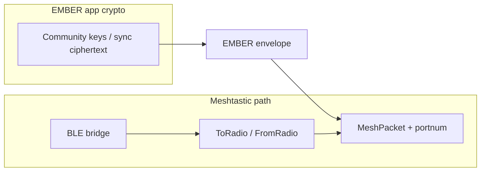

# Plan: Mesh Tier 2 rollout (application layer → product)

| Field | Value |
|--------|--------|
| Author | EMBER maintainers |
| Date | 2026-04-06 |
| Updated | 2026-04-04 (crisis **People** tab + roster banner + broadcast success alert) |
| Branch / PR | (set when work starts) |
| Status | Active (P4–P5 landed; see section 9) |

Related: [MESHTASTIC-BLE.md](./MESHTASTIC-BLE.md) (current prototype), [ARCHITECTURE.md](./ARCHITECTURE.md) §10.

## 1. Problem

The app can pair with a Meshtastic radio, complete the **config handshake**, and exchange **Phase B** ciphertext over **portnum 270** (merge on peers). Remaining work is to make that path **production-safe and field-reliable**: **encrypted payloads over LoRa** are real, but **BLE/mesh UX**, **airtime robustness**, **permissions/onboarding**, **testability**, and **crisis copy** must keep tightening—without blurring trust boundaries between Meshtastic link crypto and EMBER community crypto.

## 2. Scope

**In scope (priority order)**

1. **Mesh application layer** — Define how EMBER encapsulates data for Meshtastic (portnum strategy, framing, size limits, versioning). Payloads remain **ciphertext or signed app-level blobs** derived from existing EMBER keys/sync; no mesh as authority for community identity.
2. **Production BLE UX** — Permissions (iOS/Android), Bluetooth power and authorization states, actionable copy, graceful degradation when the radio is not in BLE/API mode.
3. **Robustness** — Serialize or queue ToRadio writes, send `disconnect` ToRadio on teardown where appropriate, basic retry/backoff for transient ATT errors.
4. **Hardware / CI** — Recorded byte fixtures or HIL hooks for regression tests of framing + selected protobuf paths.
5. **Product alignment** — Surface mesh status and sends in **crisis** flows (within mockup direction) when the lower layers are stable enough not to mislead users.

**Out of scope (for this plan)**

- Replacing EMBER passphrase-derived sync with Meshtastic channel PSK as the community root of trust.
- OTA firmware orchestration for third-party radios (document only; no commitment).
- Full network topology graph until node DB ingestion is product-prioritized.

## 3. Security and privacy boundaries

- **Data classification:** Mesh payload proposal must carry only **already-encrypted or intentionally public metadata** (e.g. bundle version, community **public** id if needed for routing UX). No plaintext PII on mesh unless explicitly approved in a future threat-model update.
- **Trust assumptions:** Meshtastic devices and other mesh participants are **untrusted** for EMBER auth. Relay and sneaker-net verification paths remain authoritative for merge decisions.
- **Crypto touchpoints:** Reuse `src/crypto/`, sync ciphertext from Phase B (`src/sync/`). New code must not generate parallel key hierarchies without ADR. Document which field is MAC’d or encrypted before `MeshPacket` assembly.
- **Permissions / platform:** BLE usage strings, Android 12+ Bluetooth permissions, background limitations; document “must use dev build” until policy is complete.

## 4. Design summary

**Phase A — Application layer (priority 1)**

- Choose **portnum**: prefer an **App-specific / experimental** Meshtastic port range per current `portnums` enum; reserve a constant in `src/mesh/` (e.g. `EMBER_PORTNUM`) and document mapping in MESHTASTIC-BLE.md.
- **Envelope:** Version byte + community **public** handle (e.g. hash of community id) + ciphertext blob length + ciphertext + optional truncated auth tag reference (if not inside ciphertext). Cap size under MTU / airtime guidance; chunk if needed (later sub-phase).
- **Send path:** API such as `sendEmberMeshPayload(bytes: Uint8Array, meta)` → build `MeshPacket` / `Data` protobuf → `ToRadio` **packet** variant (not only want_config). Integrate with session after handshake complete.
- **Receive path:** FromRadio **packet** decoding → verify envelope version → pass ciphertext to existing decrypt/merge pipeline or a stub queue until merge rules are defined.

**Phase B — Production BLE UX (priority 2)**

- Centralize Bluetooth state UI strings; Settings + optional crisis banner when radio disconnected.
- Pre-connect checklist: adapter on, permission granted, short troubleshooting link (in-repo doc anchor).

**Phase C — Robustness (priority 3)**

- Single-writer queue for ToRadio from JS; await completion before next write.
- On disconnect: `encodeDisconnect()` + cancel FromNum + `resetStream()`.

**Phase D — CI / fixtures (priority 4)** — *Implemented*

- Committed **`__tests__/mesh/fixtures/wireGolden.ts`**: framed `ToRadio` bytes (e.g. `want_config`, Meshtastic `disconnect`). **`wireGolden.test.ts`** checks encoders and single-packet **`unframeMeshtasticStream`** parse. Regenerate via **`scripts/print-mesh-wire-golden.mjs`** when protobuf/framing changes. *Optional later:* `FromRadio` goldens (still no live radio in CI).

**Phase E — Product alignment (priority 5)** — *Implemented (initial)*

- **Home** tab mesh block: Bluetooth + LoRa bridge state from **`useMeshRadioStore`**, with copy that separates **community roster** (synced data) from **radio link** (not cellular/internet). Crisis mode uses accent color on the radio line; Settings remains the detailed control surface. *Later:* last send/recv time, crisis-only entry, MVP-GUIDE pass.

## 5. Acceptance criteria

**Phase A — Application layer**

1. Given a completed config handshake, when the app sends an EMBER mesh message, then the radio accepts a **valid** `ToRadio.packet` that decodes on a serial/API client as the chosen portnum with the envelope prefix matching spec.
2. Given a received mesh packet for the EMBER portnum, when the payload passes envelope checks, then ciphertext is handed to a single documented entry point (stub or real merge) without crashing on malformed input.

**Phase B — BLE UX**

3. When Bluetooth is Unauthorized or PoweredOff, the Settings mesh section shows **specific** copy and does not loop failed scans silently.
4. iOS and Android permission strings exist and match actual capability requests (verified in dev builds).

**Phase C — Robustness**

5. When three sends are triggered in quick succession, then writes complete in order without characteristic overlap errors under normal conditions (manual or integration test notes).
6. When the user disconnects, then the app sends disconnect ToRadio (best-effort) and clears subscriptions without leaking listeners across reconnects.

**Phase D — CI**

7. CI runs tests that parse committed fixtures for framing + envelope without `react-native-ble-plx` hardware.

**Phase E — Product**

8. Crisis UI entry shows mesh connection state consistent with Settings; no contradictory claims vs MESHTASTIC-BLE.md trust model.

## 6. Test plan

| Criterion | Test level | Location |
|-----------|------------|----------|
| 1 – ToRadio packet shape | unit + manual serial tap | `__tests__/mesh/` + manual with Meshtastic CLI |
| 2 – Receive entry | unit | `__tests__/mesh/` envelope parser |
| 3–4 – BLE states | manual | iOS + Android dev clients |
| 5 – Write queue | integration / manual | Settings stress or detox (optional) |
| 6 – Teardown | manual | disconnect/reconnect 10x |
| 7 – Fixtures | CI unit | `wireGolden.ts` (+ **v2 single-chunk** ToRadio), `wireGolden.test.ts`; regen `node scripts/print-mesh-wire-golden.mjs` |
| 8 – Crisis copy | manual QA | Home mesh strip + Settings; review vs MVP-GUIDE when that doc is finalized |
| Field | Two-device | [MESH-FIELD-TEST.md](./MESH-FIELD-TEST.md) runbook |

## 7. Rollout and rollback

- Roll out behind a **feature flag** or `__DEV__`-only send button until Phase A criteria pass on hardware.
- Rollback: disable send UI; keep read-only diagnostics; protobuf schema changes must bump envelope version.

## 8. Open questions

- Exact **portnum** value to reserve vs conflict with community forks (document in repo + optional upstream issue).
- **Chunking:** single-packet vs store-and-forward for large sync blobs (defer until airtime budget known).
- **Legal:** GPL-3.0 protobuf package + AGPL app — confirm distribution stance with counsel (already noted in MESHTASTIC-BLE.md).

---

**PR checklist:** Link this file in the PR description. Do not merge until section 6 is satisfied or exceptions are documented under section 8 with owner and date.

## 9. Execution order (checklist)

Complete in order; later phases may start stubs but must not ship user-facing sends until Phase A is done.

- [x] **P1** Envelope spec in MESHTASTIC-BLE.md + portnum constant + parser tests (no radio).
- [x] **P1** Build/send `ToRadio.packet` from session; hex preview + `__DEV__` send in Settings.
- [x] **P1** Receive path: FromRadio `packet` → `dispatchEmberMeshFromFromRadio` + digest + optional listener (merge TBD).
- [x] **P2** BLE state guidance (`bleUserStrings`), Settings hints + **Open system settings**, refined iOS usage strings, troubleshooting doc.
- [x] **Gate 0 (field BLE)** Android `requestBleScanRuntimePermissions` before Mesh scan; **Refresh Bluetooth state** in Settings; `Unknown` / platform-specific copy; Home link to system settings when unauthorized/off; onboarding Tier 2 card; doc troubleshooting for runtime perms.
- [x] **Mesh → Phase B merge** `subscribeEmberMeshInbound` (multi-listener); `mergeFromEmberMeshEnvelopeForCommunity` (fingerprint + decrypt + `mergeMembersCheckInsPayload`); `MeshSyncInboundBridge` in root layout; `buildEncryptedMembersCheckInsBundleForMesh`; dev send uses mesh-sized real bundle; ciphertext cap **211** B UTF-8.
- [x] **Mesh chunking** Envelope **v2** (+ **`tryParseEmberMeshWirePayload`**); **`emberMeshChunkReassembly`** (TTL, size caps); **`sendEmberMeshMessageUtf8`** (v1 fast path or v2 + inter-frame delay); dev send = **full** `buildEncryptedMembersCheckInsBundle`.
- [x] **P3** Serialized ToRadio writes, `closing` guard, Meshtastic `disconnect` ToRadio before `cancelConnection`, ordered `destroy()`.
- [x] **P4** Golden **`ToRadio`** wire fixtures (`wireGolden.ts`) + Jest regression tests + **`print-mesh-wire-golden.mjs`** (see MESHTASTIC-BLE.md Tests).
- [x] **P5** Product-facing mesh status: **`MeshRadioProvider`** in `app/_layout.tsx`, shared store, Home/Status copy (roster vs LoRa bridge); crisis tint on radio line; crisis tab label **People** (not “Mesh”) with roster explainer; **Mesh snapshot sent** alert on successful broadcast. **Residual:** last send/recv timestamps, richer crisis mesh surface, adaptive airtime, formal MVP-GUIDE / pilot sign-off.
